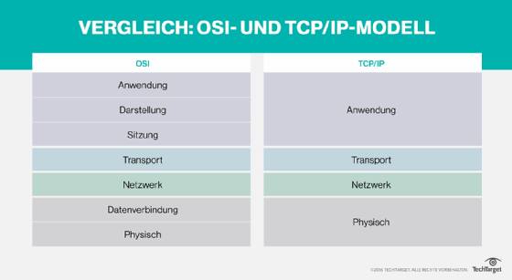

# OSI

## Schichten

### 1- Physical Layer

* Bitübertragung
* Kabel Stecker
* Direkte Übertragung an Gegenstück

## 2- Sicherungsschicht (Datalink)

* Errorless re/transceive
* frames, crc checksums

## 3- Vermittlungsschicht (Network Layer)

* Packets, Routing,
* IP Protocol

## 4- Transport Layer

* Segments the data, Datenkapselung
* Ports, Protocols UDP / TCP

## 5- Session Layer

* RPC Protocol, Sitzung
* Steuerung logischer Verbindungen im Net

## 6- Darstellungsschicht (Presentation Layer)

* Datenkomrpession, Verschlüsslung

## 7- Anwenungsschicht (Application Layer)

* Daten I/O

---

# Antworten Repetitionsfragen

2. Schichten
2.1. OSI Modell: 7 Schichten

6.
    * Switch: 3
    * Router: 3
    * Gateway / FW: 3 & 4
    * MacAddr: 2
    * IP: 3
    * Port: 4

7. Session
8. Erste drei Bits Hersteller
9. Broadcastadresse höchste Zahl: FF:FF:FF:FF:FF