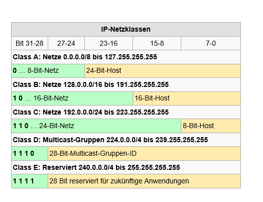

# Ip Adressen

## IANA

* responsible for managing root-domains and IP-Adresse-Spaces
* Continents, where other instance hands out ips
    * Europe: Ripe.net

## IPv4

* 32-Bit in je 4 Oktets
* 192.168.0.1 - 10010010.10011100.00001101.000000001\
    *       ^-------------------------^^-------^
    *                  Netzbereich       Host
**Adrr. Klassen A-D**

**Maximale Anzahl IPAdressen**

* 2^(Anzahl Host Stellen) - 2
* übliches Netzwerk: 254
