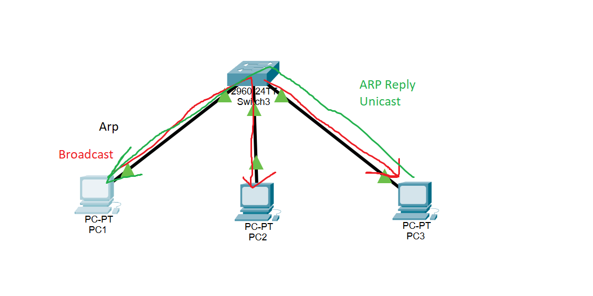

# Notes

## Unicast

* sending from single node to other node
* streaming from server online

## Multicast

* sending from one to n nodes
* Streaming live online -> multiple receivers

## Broadcast

* just sends to air
* everyone can receive if they want to

## ARP

_Address Resolution Protocol_

Table in which says which IP belongs to which MacAddr

### Simulation ARP

1. Arp Request als **Broadcast** (MC: FF:FF:FF:FF) in Rot
2. Arp Reply von Host 3 als **Unicast** in Grün
3. Danach IP & MC in ARP Tabelle vorhanden

**Broadcast Domain**
* in eigenem Netzwerk zusammengesetzt aus IP & Subnet
* ARP Broadcast nicht über Subnetzmaske hinweg

**Kollisions Domain**
* in den alten Zeiten, als noch Hubs benutzt wurden, gab es solche
* wenn auf Layer 1 mehrere Packets gesendet, können kolidieren
    * wie bei Wifi -> alle Geräte gleiches Medium (Luft)