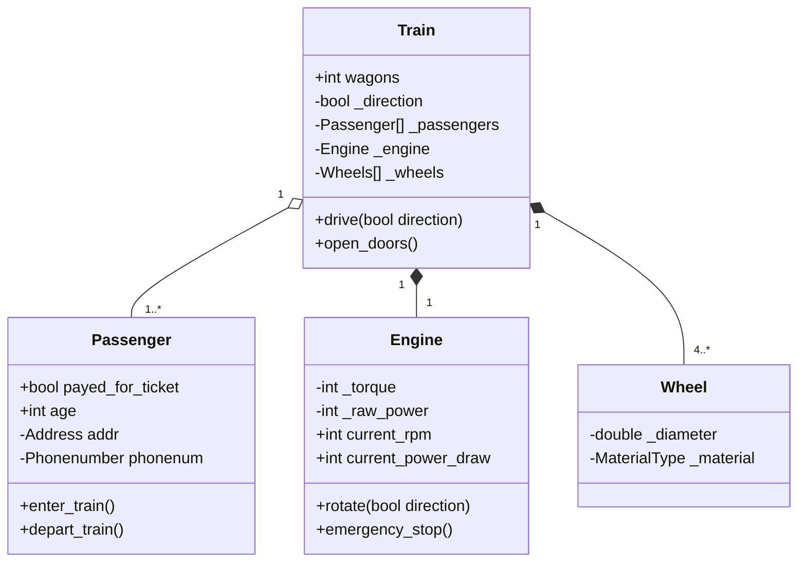

# Assoziation

## Aggregation

_loose coupling_

* eine Beziehung zwischen zweier Klassen / Objekten welche von schwacher Verbindung ist
* wenn zwischen A und B eine Aggregation besteht, und B gelöscht wird, bleibt A bestehen
* A ist ein Teil von B

## Komposition

_strong coupling_

* eine **lebensnotwendige Beziehung** zwischen zwei Objekten, auch eine starke Verbindung
* die Beziehung ist notwendig, denn wenn A gelöscht wird, passiert dies für B auch
* A ist ein **sehr wichtiger** Teil von B

## Beispiel Aggregation & Komposition

Dieses Beispiel soll veranschaulichen wie Aggregation und Komposition erstmals auschauen
in einem UML Diagramm und andereseits auch ihre Funktionsweise zeigen.

### Aggregation

Ein Zug kann mehrere Passagiere beinhalten, aber beide sind noch sich selbst wenn sich ihre Wege trennen.
Heisst wenn _Bill_ aus dem Zug aussteigt, hat er immer noch die Fähigkeit Passagier zu sein, obwohl
er nicht mer aktiv im Zug unterwegs ist. Der Zug ist auch immer noch ein Zug, obwohl keine Passagier
in ihm mitgeführt werden.

### Komposition

Ein Zug kann nicht ohne Motor herumfahren, genauso wenig ohne mindestens 4 Räder. 
Bedeutet wenn man diese Teil vom Zug entfernt kann man mit ihnen "nicht" anfangen, und der
Zug ist auch nicht mehr tüchtig seine Funktion auszuführen.



### Code Beispiel C#

```c#
using System;

namespace ModelEarth {
    enum TrainType {
        HighSpeed,
        InterCity,
        Commuter,
        RapidTransport
    }
    
    public class Engine {
        int _torque;
        bool _direction;
        
        public bool Turn();
    }
    
    public class Seat {
        int _width;
        int _comfortLevel;
    }
    
    public class PassengerFigurime {
        public string Name {get; set;}
        public string Occupation {get; set;}
    }

    public class ModelTrain {
        public string Name {get; set;}
        public TrainType Type {get; set;}
        public RailroadCar[] Wagons {get; set;} // not a train without any wagons
        private PassengerFigurime[] _passengers; // 0 or more passengers, can move in and out of train
    }
    
    public class RailroadCar {
        int _weight;
        int _length;
    }
    
    public class Locomotive : RailroadCar {
        Engine _engine;
        // control panel etc.
    }
    
    public class Coach : RailroadCar {
        Seat[] _seats;
        public int readonly NumberOfSeats;
    }
}
```
